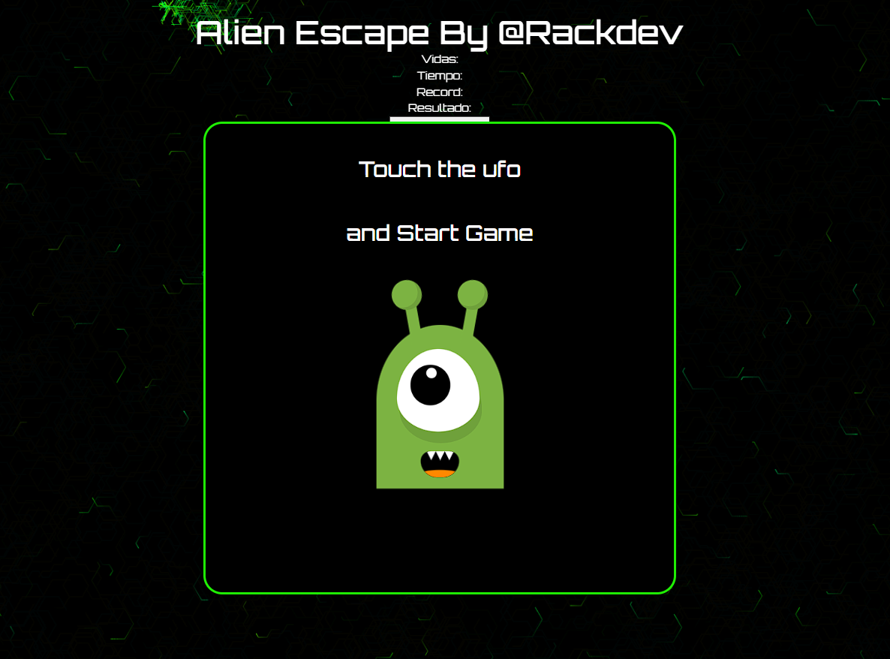
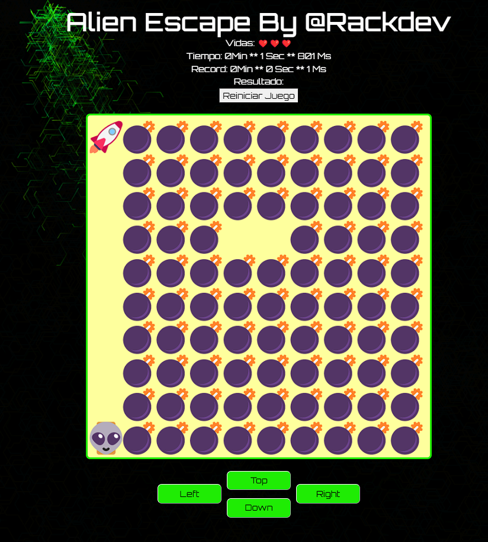

# PROYECTO VIDEOGAME JAVASCRIPT

- framework elegido es NestJS

----

<p align="center">
  <a href="http://nestjs.com/" target="blank"></a>
</p>


  <p align="center">A videogame developed with <a href="https://www.ecma-international.org/" target="_blank">Javascript.js</a> and css technologies.</p>
    <p align="center">

</p>
  <!--[](https://opencollective.com/nest#backer)
  [](https://opencollective.com/nest#sponsor)-->

## Description

Videogame not collision with bombs.

## Installation

```bash
$ Execute the index html
```

## Demo

<a href="https://www.npmjs.com/~nestjscore" target="_blank">https://alien-escape-game.netlify.app/</a>


## Screenshots:

<p align="center">
  <a href="https://alien-escape-game.netlify.app/" target="blank"></a>
</p>

<p align="center">
  <a href="https://alien-escape-game.netlify.app/" target="blank"></a>
</p>


## License

Nest is [MIT licensed](LICENSE).
